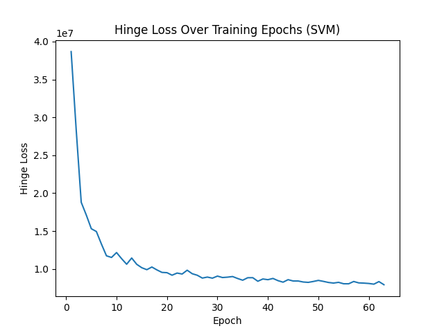
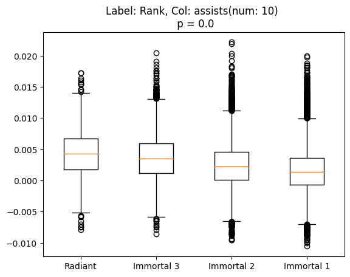
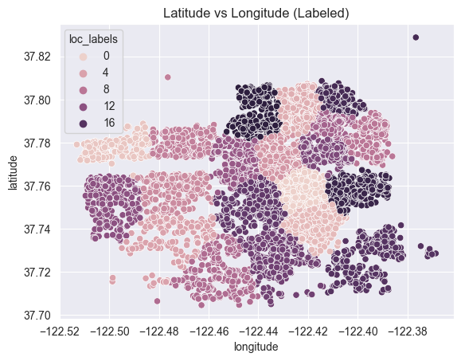

<h1 align = "left"> Hello, my name is Sonny! 🐣 </h1>

---

### About Me 📰

Data-driven researcher passionate about collaboration, innovation, and leveraging machine learning to solve complex problems in healthcare. I contribute to cutting-edge projects at the NERVES Lab and the Utah NeuroRobotics Lab at the University of Utah. I have designed wireless sEMG chips and MATLAB programs to process body-worn sensor signals automatically. I have worked with complex machine learning systems for neuroprosthesis. Currently working to create a system that uses methods from reinforcement learning to predict real-time gait transitions over difficult terrain in Python. Seeking opportunities to develop my expertise in artificial intelligence and machine learning to drive impactful research through collaborative endeavors. Let's innovate together! #Innovation #MachineLearning #DeepLearning #AI #DataScience

- I'm currently pursuing my Ph.D in Biomedical Engineering with an emphasis in Data Science and Computation 💻
- I'm currently a Graduate Research Assistant for the NERVES Lab, University of Utah 🧠
- Appropriate coursework: Data Science for Biomedical Engineers, Reinforcement Learning Specialization, Machine Learning, Artificial Intelligence
- Interested in Machine Learning, Deep Learning, and AI 🦾

#### Programming Skills  
Proficient: Python | MATLAB | C/C++ | LabView  
Familiar: Java | SQL | R

#### Tools and Software  
Visual Studio Code | Jupyter | Git | PyCharm | QtCreator | Qualtrics | Adobe Suite | Fusion 360

---

### Education 📖
#### Biomedical Engineering, PhD @ University of Utah (In-Progress)  
#### Biomedical Engineering, MS @ University of Utah (In-Progress)   
#### Biomedical Engineering, BS @ University of Utah  

---

### Certification 📃
#### Graduate Certificate in Deep Learning (In-Progress) (University of Utah)  
[[Certification Homepage](https://www.cs.utah.edu/graduate/academic-programs/certificate-programs/graduate-certificate-in-deep-learning/)]  
#### Reinforcement Learning Specialization (University of Alberta & Alberta Machine Intelligence Institute)  
[[Specialization Homepage](https://www.coursera.org/specializations/reinforcement-learning)][[View Certificate](https://www.coursera.org/verify/specialization/CWUW9VCJAC87)]  
#### Data Science Professional (DataCamp)  
[[Course Homepage](https://www.datacamp.com/tracks/data-scientist-professional-with-python)][[View Certificate](https://www.datacamp.com/certificate/DS0020609141286)]  
#### Machine Learning Scientist (DataCamp)  
[[Course Homepage](https://www.datacamp.com/tracks/machine-learning-scientist-with-python)][[View Certificate](https://www.datacamp.com/completed/statement-of-accomplishment/track/8b3cc836625f4ce083af49e5f01d0038ee2aeee7)]  

---
  
### Research Experience 🥼
#### Graduate Research Assistant @ NERVES Lab  
#### Research Assistant @ NeuroRobotics Lab  
#### Undergraduate Research Assistant @ Center for Neural Interfaces  

---
  
### Projects 💻
#### Machine Learning Library From Scratch [[View Project](https://github.com/sonnyjones123/MachineLearningLibrary)]
- Implemented machine learning algorithms from scratch for the CS 6350 Machine Learning course project.
- Algorithms:
    - Decision Tree Classifier: ID3 Implementation
    - Perceptron: Mistake Bound Implementation
    - Logistic Regression: Maximum Likelihood Estimation and Maximize a Posteriori Implementation
    - Support Vector Machine: Objective Function Minimization Implementation
    - Ensembles: Bagging, AdaBoost, SVM Over Trees
- Achieved Top 10 classification performance in the class Course Project Kaggle.
- Keywords: Python, Decision Tree, Perceptron, Logistic Regression, SVM, Ensembels

  
#### Lunar Lander Reinforcement Learning Agent [[View Project](https://www.coursera.org/learn/complete-reinforcement-learning-system)]  
- Created a deep reinforcement learning agent to learn how to land on a simulated moon.
- Software: Python, Jupyter, OpenAI Gym
- Keywords: Reinforcement Learning, Function Approximation, NN, SARSA, Q-Learning

#### Singular Value Decomposition (SVD) for Trend Identification in Valorant Ranked Data [[View Project](https://github.com/sonnyjones123/ValorantDataSVD)]
- Utilized SVD to identify trends in player statistics for Valorant.
- Identified multiple significant statistics that might help differentiate players by rank.
- Developed an NN (Multilayer Perceptron) classifier to predict player rank from player statistics. 
- Software: Python, Jupyter, Sklearn, Scipy
- Keywords: SVD, MLP

#### Predicting Property Rental Prices [[View Project](https://github.com/sonnyjones123/HouseRentalPricing)]
- Developed machine learning models to predict property rental prices from housing data.
- Utilized exploratory methods like correlation matrices and scaling for feature engineering.
- Implemented stacking KNN and regression techniques to improve model performance.
- Software: Python, Jupyter, Sklearn
- Keywords: Modeling, Regression, Decision Trees, KNN

#### Predicting Credit Card Approvals [[View Project](https://app.datacamp.com/workspace/w/09444c1a-dc78-4525-a510-0a9b048331e3)] 
- Developed machine learning models based on previous approval data to predict credit card approval.
- Software: Python, Jupyter, Sklearn
- Keywords: Modeling, Regression
