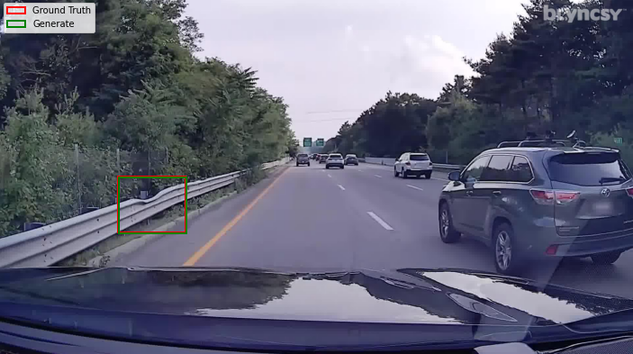

<link rel="stylesheet" type="text/css" href="style.css">
<h1 align = "left"> Hello, my name is Sonny! 🐣 </h1>

---

### About Me 📰

As a passionate data-driven researcher, I thrive on collaboration and innovation, particularly in leveraging machine learning to revolutionize healthcare. I contribute to cutting-edge projects at the NERVES Lab and the Utah NeuroRobotics Lab at the University of Utah. My work included designing wireless sEMG chips, programs to process body-worn sensor signals automatically, and developing cognitive workload measurements for complex machine learning systems for neuroprosthesis. 

I am working to create advanced learning systems that use state-of-the-art reinforcement learning algorithms to control exoskeletons for post-stroke assistance while walking on and between different terrains. I seek opportunities to develop my data science, artificial intelligence, and machine learning expertise and drive impactful research through collaborative endeavors.

Let's innovate together! #ML #AI # RL#DataScience

  <ul>
    <li>I'm currently pursuing my Ph.D in Biomedical Engineering with an emphasis in Data Science and Computation 💻 </li>
    <li>I'm currently a Graduate Research Assistant for the NERVES Lab, University of Utah 🧠 </li>
    <li>Appropriate coursework: Data Science for Biomedical Engineers, Reinforcement Learning Specialization, Machine Learning, Artificial Intelligence, Deep Learning, NeuroRobotics </li>
    <li>Interested in Machine Learning, Reinforcement Learning, Deep Learning, and AI 🦾 </li>
  </ul>

#### Programming Skills  
Proficient: Python | MATLAB  
Familiar: C/C++ | LabView | Java | SQL | R

#### Tools and Software  
Visual Studio Code | Jupyter | QtCreator | PyCharm | Git | Anaconda | LaTeX

---

### Education 📖
#### Biomedical Engineering, PhD @ University of Utah (In-Progress)  
#### Biomedical Engineering, MS @ University of Utah (In-Progress)   
#### Biomedical Engineering, BS @ University of Utah  

---

### Certification 📃
#### Graduate Certificate in Deep Learning (In-Progress) (University of Utah)  
[[Certification Homepage](https://www.cs.utah.edu/graduate/academic-programs/certificate-programs/graduate-certificate-in-deep-learning/)]  
#### Reinforcement Learning Specialization (University of Alberta & Alberta Machine Intelligence Institute)  
[[Specialization Homepage](https://www.coursera.org/specializations/reinforcement-learning)][[View Certificate](https://www.coursera.org/verify/specialization/CWUW9VCJAC87)]  
#### Data Science Professional (DataCamp)  
[[Course Homepage](https://www.datacamp.com/tracks/data-scientist-professional-with-python)][[View Certificate](https://www.datacamp.com/certificate/DS0020609141286)]  
#### Machine Learning Scientist (DataCamp)  
[[Course Homepage](https://www.datacamp.com/tracks/machine-learning-scientist-with-python)][[View Certificate](https://www.datacamp.com/completed/statement-of-accomplishment/track/8b3cc836625f4ce083af49e5f01d0038ee2aeee7)]  

---
  
### Research Experience 🥼
#### Graduate Research Assistant @ [NERVES Lab](https://nerves.bme.utah.edu/)  
#### Research Assistant @ [NeuroRobotics Lab](https://neurorobotics.ece.utah.edu/)
#### Research Analyst/Assistant @ [TORCH](https://medicine.utah.edu/internal-medicine/epidemiology/research-programs/torch) 
#### Undergraduate Research Assistant @ [Center for Neural Interfaces](https://cni.bme.utah.edu/)

---
  
### Projects 💻

#### Fine-Tuning Faster R-CNN for Guardrail Damage Detection [[View Project](https://github.com/sonnyjones123/BlyncsySFT)]

  <ul>
    <li>Researched and implemented advanced fine‑tuning strategies on a Faster R‑CNN to detect guardrail damage, improving detection accuracy by 5% and decreasing false positives by 92% for <a href="https://www.blyncsy.com/">Blyncsy, Inc.</a> </li>
    <li>Designed a saliency‑scoring pipeline leveraging pre‑trained networks to automatically verify ground truth labels in the training and testing sets, automatically finding errors in roughly 10% of images. </li>
    <li>Engineered end‑to‑end training pipelines for a custom Faster R‑CNN, packaged as the <a href="https://pypi.org/project/BlyncsySFT/">BlyncsySFT</a> pip module for easy deployment and reproducibility.
    <li>Keywords: Python, PyTorch, Object Detection, Pip </li>
  </ul>

#### Machine Learning Library From Scratch [[View Project](https://github.com/sonnyjones123/MachineLearningLibrary)]

  <ul>
    <li>Built a custom Python ML library with cross‑validation to support ID3, perceptron, logistic‑regression, and SVM classifiers. </li>
    <li>Leveraged library to secure a top‑10 finish out of 150+ teams in a course Kaggle NLP classification challenge. </li>
    <li>Performed feature transformation, dimensionality reduction, and hyperparameter tuning to increase model accuracy. </li>
    <li>Algorithms: ID3 decision tree, mistake‑bound perceptron, MLE/MAP logistic regression, objective‑minimization SVM, ensemble methods (bagging, AdaBoost, SVM‑over‑trees)</li>
    <li>Keywords: Python, Decision Tree, Perceptron, Logistic Regression, SVM, Ensembles </li>
  </ul>

#### Helping Pac-Man Using AI Techniques [[View Project](https://github.com/sonnyjones123/PacmanAI)]

  <ul>
    <li>Implemented various search algorithms (A*, Alpha-Beta, Expectimax) to solve navigation problems efficiently. </li>
    <li>Utilized RL methods to teach Pac-Man how to navigate the grid world environment and chase ghosts. </li>
    <li>Created probabilistic models using Bayes Nets/Particle Filtering to help Pac-Man hunt invisible ghosts from observations. </li>
    <li>Breakdown of Projects: 
      <ul>
        <li>Project 1: Search. BFS, DFS, A* </li>
        <li>Project 2: Minimax, Alpha-Beta, Expectimax </li>
        <li>Project 3: RL, Value and Policy Iteration, Q-Learning </li>
        <li>Project 4: Bayes Nets, Particle Filtering </li>
      </ul>
    </li>
    <li>Keywords: Python, Artificial Intelligence (AI), Reinforcement Learning (RL), Search, Bayes Nets </li>
  </ul>

  
#### Lunar Lander Reinforcement Learning Agent [[View Project](https://www.coursera.org/learn/complete-reinforcement-learning-system)]

  <ul>
    <li>Implemented reinforcement learning algorithms to control agents to land on a simulated moon in OpenAI Gym. </li>
    <li>Trained deep Q-Learning network with RMSProp to control action selection. </li>
    <li>Explored the effects of different learning parameters on agent success and behavior. </li>
    <li>Software: Python, Jupyter, OpenAI Gym </li>
    <li>Keywords: Reinforcement Learning (RL), Function Approximation, SARSA, Q-Learning </li>
  </ul>

#### Singular Value Decomposition (SVD) for Trend Identification in Valorant Ranked Data [[View Project](https://github.com/sonnyjones123/ValorantDataSVD)]

  <ul>
    <li>Utilized SVD to identify trends in player statistics for Valorant. </li>
    <li>Identified multiple significant statistics that might help differentiate players by rank. </li>
    <li>Developed an NN (Multilayer Perceptron) classifier to predict player rank from player statistics.</li>
    <li>Software: Python, Jupyter, Sklearn, SciPy </li>
    <li>Keywords: SVD, MLP </li>
  </ul>

#### Predicting Property Rental Prices [[View Project](https://github.com/sonnyjones123/HouseRentalPricing)]

  <ul>
    <li>Developed machine learning models to predict property rental prices from housing data. </li>
    <li>Utilized exploratory methods like correlation matrices and scaling for feature engineering. </li>
    <li>Implemented stacking KNN and regression techniques to improve model performance. </li>
    <li>Software: Python, Jupyter, Sklearn </li>
    <li>Keywords: Modeling, Regression, Decision Trees, KNN </li>
  </ul>

#### Predicting Credit Card Approvals [[View Project](https://app.datacamp.com/workspace/w/09444c1a-dc78-4525-a510-0a9b048331e3)] 

  <ul> 
    <li>Developed machine learning models based on previous approval data to predict credit card approval. </li> 
    <li>Software: Python, Jupyter, Sklearn </li> 
    <li>Keywords: Modeling, Regression </li> 
  </ul>

